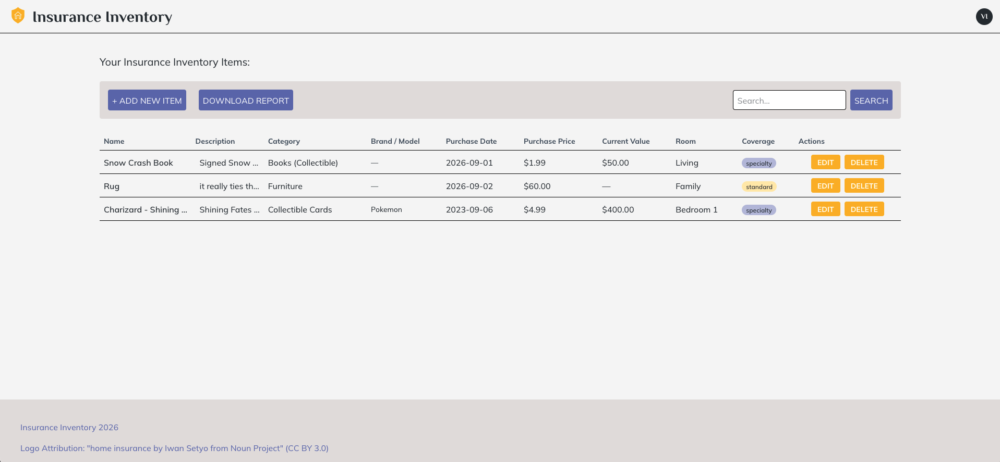

# Insurance Inventory

This application allows insurance members to document their inventory for use in claims and adjustments. 

This application was built with Next.js(React/TS), Tailwind, Drizzle, and Zod.

You can try it out [here](https://insurance-inventory-app.vercel.app) using the login credentials test@test.com and testHere123!

---